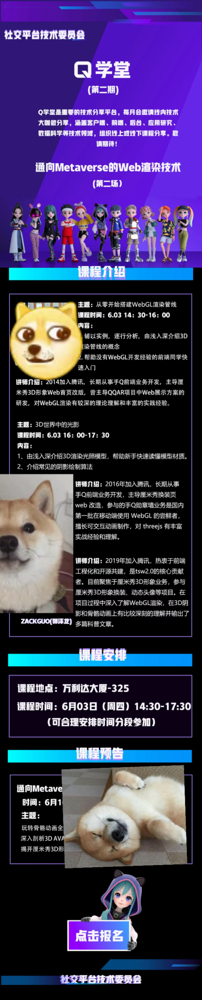
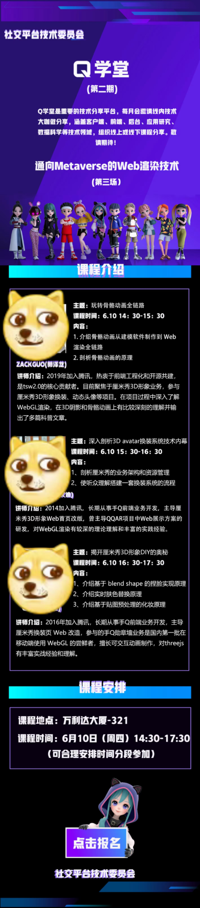

# 腾讯工作记录

## [一] 2019 年 7 月～ 2020 年 1 月

**以校招生的身份在鹅厂工作了半年。主要做了以下几件事：**

- 接手了 QQ 小程序三个管理端。
- 为运营管理端接入 Sentry 系统，监控用户使用时前端层面的报错。
- 为开发者管理端接入 Monitor 系统，自制工具，监控 node 层 所有 pb 接口的运行。
- pcg mini 项目：闪光的我 - 微信小程序
- 配合 2019 tweb 大会，采访阿里水澜-rax(serverless ssr)
- 搭建管理端 vue 组件库，提升后期管理端需求开发效率。
- 研究 protobuf 校验工具，封装成 ci 插件，解决目前业务中未对提交的 pb 文件进行校验的痛点。
- 四次组内分享：GraphQL，mini 项目研发，1113 发布故障小结，SCF 探索。
- 沉淀了 12 篇 KM 文章：
  - 《GraphQL》
  - 《Sentry 上报接入》
  - 《monitor 监控接入》
  - 《tsw 与业务代码的交互逻辑》
  - 《node 层使用 protubuf》
  - 《pbLint - 从小工具到 oci 插件》
  - 《自制 vue 组件库》
  - 《简析 orange-ci 工作流》 - KM 推荐
  - 《1113 织云包发布故障小结》
  - 《探索 docker 本质》
  - 《scf 使用初探》
- 为 oci 做 12 月的 epc 举证。

&nbsp;&nbsp;感觉这段时间，收获满满。看到了和大佬们的差距，也逐渐喜欢上了写代码的过程。下一个半年，先试着在 node 这条路上走走。

## [二] 2020 年 1 月～ 2021 年 2 月 H1

**绩效 - 四星**

- **一. 推进上半年大组 EPC(研发效能) 评估**
  - 1.  对试点项目进行评估：了解 EPC 标准和相关流程，对 Orange-ci 进行评估。
  - 2.  指导其他项目落地 EPC: 给大组接口人和组内成员做分享，为后续推动 EPC 全面落地提供指导。
  - 3.  提升 EPC 标杆项目到 Level 3: 提升小程序小游戏 H5 的 EPC 评分，已达到 Level 3。
- **二. 开源协同**
  - 1.  参与 TSW 2.0 建设:
    - (1) 研究 TSW 1.0 源码，输出到 km，为后续 2.0 重构做准备。
    - (2) TSW2.0 核心功能完成 90%，个人完成了代理机制(原染色)，上报过滤以及 ts-node 兼容等功能。
    - (3) 完成 Benchmark，为下半年性能优化作准备。
    - (4) 针对 TSW 2.0 诞生背景，优化和实现，整理成 km，方便接入方了解。
    - (5) 在 QQ 公众号管理端中接入 TSW 2.0，从业务角度进一步完善项目。
  - 2.  参与 Oteam 建设 - TDesign
    - 协同完成一期组件开发：目前已完成认领的消息通知类组件的开发，比如 Notification / Message 的 API 设计， UI 开发， 组件开发，测试。
- **三. QQ 公众号管理端重构**
  - 搭建 node 层服务：
    - (1) 接入 Typescript, 提示代码质量。
    - (2) 接入北极星，替换 L5。
    - (3) 接入 TSW2，精简业务代码。
    - (4) 打通 STKE + OCI 自动化测试环境部署，提升研发效率。
- **四. 重构开发管理端注册流程，解决现网注册流失的问题**
  - 1.  重构开发管理端注册流程，接入人脸识别，提升用户体验。
  - 2.  采用新的数据上报模式，打通 Atta + Datahub + 灯塔 的数据链路。
- **五. 沉淀了 3 篇 km 文章：**
  - 《tsw2.0》
  - 《基于 EPC-Level-5 的工作流改进》
  - 《qq 小程序管理端前端架构总结》

<!--  -->

## [三] 2020 年 1 月～ 2021 年 2 月 H2

- **一. 推进下半年大组 EPC 评估**
  - 1.  提升 EPC 标杆项目到 Level 4: 小程序小游戏 H5 下半年 EPC 评分已达 Level 4。
  - 2.  提升 QQ 小程序/ QQ 小游戏自动化测试到 Level 4：截止 11 月底，负责的标杆项目自动化测试全量覆盖率已达 60%，增量覆盖率已达 73%；同时小程序小游戏 H5 自动化测试评分已达 Level 4。
  - 3.  调研 Web E2E 测试并落地:
    - (1) 调研基于 DWT + Orange-ci 的 Web E2E 测试方案，并成功在小程序开发管理端落地。
    - (2) 将 Web 端到端测试方案沉淀到 KM 上，指导其他项目落地，获得 KM 推荐。
- **二. 支持厘米秀需求迭代**
  - 1.  实现 3D 换装在 手 Q 内的闭环操作：将厘米秀 3D 换装 从卡噗 APP 上迁移到 手 Q H5，同时接入银河监控，监测页面性能。
  - 2.  开发 3D 胶囊：对标 2D 厘米秀，开发 3D 胶囊。
  - 3.  接入春节红包，新增红包胶囊。
- **三. 开源协同**
  - 1.  共建 Orange-ci - 17 PR, 2 Features, 5 Issues
    - (1) 集成腾讯文档到 OCI，新增文档上传等内置任务，为 EPC 报告提供基础服务。
    - (2) 优化流水线 UI，新增模块查看格式化的 yaml 配置。
    - (3) 协同修复 issues。
  - 2.  共建 Oteam 项目 - TDesign - 19 PR, 8th Contributor
    - (1) 持续优化 TDesign 中消息通知类组件：Dialog, Message, Notification。
    - (2) 管理端接入 TDesign。
  - 3.  TSW 2.0 持续优化
    - (1) 接入 Lerna 管理 TSW 开放平台插件，提升发布效率。
    - (2) 协助业务接入 TSW 2.0。
- **四. 沉淀了 2 篇 km 文章**
  - 《Web 端到端测试》 - KM 推荐
  - 《Web 项目 EPC 快速接入指引》

   
 &nbsp;&nbsp;回顾下来，这一年还是做了很多事情的。参与了不少公司级重要的开源项目，也得到了总监的认可，拿到了四星。美中不足的就是没能走绿色通道，但自己也已经尽力了。
 另一方面，因为接手了3D厘米秀,接触到了前端的一个垂直领域 - 3d渲染，希望今年能在可视化领域有所深入。

## [四] 2021 年 3 月～ 2022 年 1 月 H1

- **一. 支持厘米秀需求迭代**
  - 1. 支持将厘米形象制作成静态和动态头像，增强厘米形象社交影响力。
  - 2. 优化厘米游戏接入体验：
    - (1) 撰写 qq 小游戏接入厘米形象文档。
    - (2) 编写 laya 小游戏接入厘米形象 demo，给开发者参考。
    - (3) 协助客户端优化厘米秀资源拉取，例如使用客户端缓存优化小游戏加载速度。
  - 3. 厘米秀首页重构，完成首页 3D 形象展示。
- **二. 开源协同**
  - 1. TSW 2.0 持续优化。
    - (1) 在 TSW 官网添加 2.0 相关文档，同时编写 KM 文章提升影响力。
    - (2) 处理现存 13 个issue。
    - (3) 新增 cleanLog 和 logLevel 配置项，优化日志打印。
    - (4) 新增对 https 服务的抓包。
  - 2. 共建 Oteam 项目 - TDesign。
    - (1) 处理 Dialog, Message, Notification 等消息通知类组件相关 7 个issue。
    - (2) 完善 Message 组件测试用例。
- **三. 沉淀了 3 篇 km 文章**
  - 《剖析骨骼动画》
  - 《3D世界中的阴影》
  - 《Threejs 自实现阴影》
- **四. 公司级分享**
  - 《玩转骨骼动画全链路》
  - 《ShadowMap 阴影实战》

## [五] 2021 年 3 月～ 2022 年 1 月 H2
- **一. 支持PC频道长期迭代**
  - 1. 在高拓展性和高可用性的原则上，完成 AIO 的整体架构与实现。
    - (1) 封装 AIO 中的无限滚动列表，供成员列表、表情面板以及消息管理器复用。
    - (2) 将消息组件与 AIO 列表解耦，后续消息类型的扩展不影响 AIO。
    - (3) AIO 动态维护上屏消息数，缩减渲染时长。
  - 2. 通过性能分析，逐步优化 AIO 首屏。目前切频道后的AIO首屏耗时较一期版本已提升 60% 以上，渲染速度对标 Discord。
    - (1) 配合 sdk 降低拉取首屏数据耗时。
    - (2) 通过切片 commit 的方式，让小部分消息先上屏，同时避免 patch 同步执行过长阻塞UI。
    - (3) 对切频道时触发的非必要事件做延时处理，缩减 mousedown 阻塞 UI 的时间。
    - (4) 图片消息懒加载，延时加载屏外图片。
  - 3. 完善AIO性能数据监控，为后续进一步优化做准备。
- **二. PC频道E2E测试落地**
  - 1. 调研业界 PC 应用的 E2E 方案，确立 QQ 频道自动化测试方案。
  - 2. 跑通 PC 频道第一个自动化测试用例。
  - 3. 后续将逐步完善测试用例，自动化保障发布质量。
- **三. 沉淀了 3 篇 km 文章**
  - 《TSW2.0: 一个零侵入的抓包神器》
  - 《十五分钟带你了解微前端》
  - 《从 WebGL 到 Threejs》

 &nbsp;&nbsp; 独立负责了 QQ 频道的核心 AIO 模块，学会了如何做性能优化。看到 PC 频道承接公司年会直播的时候，还是十分有成就感的。同时一个人 Cover E2E 测试这个技术项，从方案选型到最终落地，虽然有一点波折，但总体还算顺利。  
 &nbsp;&nbsp; 不过今年意外的没有拿到高绩效，虽然 leader 还特地过来一对一画饼了，但如果下一年还是没有拿到满意的资源，就该毕业了。